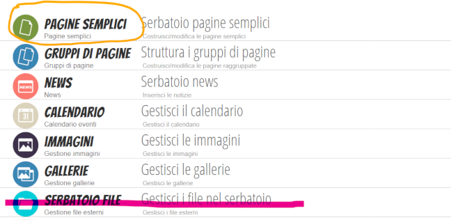

# Sito marconiverona.edu.it (2019)

## Done!

*	Organizzazione homepage e menu
*	Riorganizzazione struttura pagine
*	Implementazione nuova architettura Archivio documenti
*	Pulizia contenuti
*	Riscrittura contenuti (alcuni)
*	Implementazione incrementale dei contenuti

## To Do Now (CONDIVISIONE)

*	Condivisione organizzazione homepage, menu e pagine
*	Condividere organizzazione pagine per editor (funzioni strumentali, ...)
* 	Condividere scelta email
*	Condividere decisione su quando passare in produzione
*	Referente Contenuti Web Extra (?)

## To Do After

*	Valorizzare i contenuti
*	Feedback su anomalie 

## Scelte

	Due account: Spaggiari (ovvio) e G-Suite (marconiverona.edu.it)
	
	Contenuti --> Pagine di gruppo e pagini semplici 
	Documenti 15 maggio --> Albo Online 
	Programmi Svolti --> Registro Online
	Documenti condivisi (Modulistica, ex Area Documenti) --> G Suite
	Modulistica --> Modulistica Smart
	Circolari (Comunicati) --> Registro Online

## Funzioni Strumentali e editor sito: pagine semplici, pagine di gruppo, folder condivisi 

**Per l'editing delle pagine del sito, le funzioni strumentali utilizzano l'account *spaggiari*.**

Per ogni funzione strumentale o editor è stato creato un gruppo di pagine contenente:

	a pagina semplice (con lo stesso nome del gruppo)
	il link (opz) con il nome **documenti** alla cartella condivisa pubblica su g-suite (il cui nome è associato al gruppo)
	
Esempio:

*Supporto ai docenti*

Pagina semplice

	Supporto ai docenti
	
Pagine del gruppo

	Supporto ai docenti (*aggancio pagina semplice*) Supporto ai docenti 
		
	Documenti (link esterno ricavato da g-suite) https://drive.google.com/drive/folders/1oWSS_aOBPmExsrUvVrUJfpasb0s8WoW1?usp=sharing

### Accesso editing pagine

Registro online

	Applicazioni

	Applicazioni - 1VisioneWeb

	Applicazioni - 1VisioneWeb - Menu
	

### Attività

Le funzioni strumentali e gli editor del sito hanno **già** (PER ORA) a disposizione:

*	pagina semplice
*	cartella condivisa su g-suite 

#### Pagina semplice

**Menu principale

**Aggiungi pagina semplice

Le pagine contengono testo ed eventualmente collegamenti altre pagine web, collegamenti a file (allegati) o riferimenti a file g-suite.

*	I riferimenti a file sono aggiunti direttamente nella pagina 
*	I collegamenti a file sono verso documenti condivisi su g-suite

 
#### Condivisione G Suite

L'accesso alla cartella condivisa su g-suite (condivisione di file e cartelle specifici per funzione) che equivale alla voce Archivio Documenti sono accessibili via portale Cloud G Suite con account *marconiverona.edu.it*

I folder condivisi sono accessibili:

*	in lettura a tutti direttamente con il link della cartella condivisa 
*	in modifica ai proprietari della cartella (esempio cartella Supporto docenti) dopo aver fatto l'accesso tramite account marconiverona.edu.it

#### Link g-suite presenti
 
**Supporto docenti**

https://drive.google.com/open?id=1oWSS_aOBPmExsrUvVrUJfpasb0s8WoW1

**Coordinamento per l'attività di inclusione**

https://drive.google.com/open?id=1XAUnMnHC2D_NTg7UoHGkYKxJLdGxW6cM

**Interventi e servizi per gli studenti**

https://drive.google.com/open?id=1TaV_JODOzYjX9rUjWYyflGHDaxnPSoM9

**Orientamento in ingresso, in itinere e in uscita**

https://drive.google.com/open?id=1-3JZe8oNwQ9M6e6Wxv405r4RdBEeKGvt

**Sicurezza**

https://drive.google.com/open?id=11wJlAwkKsPeVfteWquR8Y-oW4ZqkKatR

**PCTO**

https://drive.google.com/open?id=1kscevvI2OBKu-mqkj3-Nb1Y55beWelEX

##### NOTA ADMIN

In Pagine di gruppo già create gli editor non possono modificare nulla, ma possono modificare le pagine semplici appartenenti al gruppo o pagini semplici da associare a nuove Pagine di gruppo. 
L'inserimento nel sito delle nuove Pagine (di gruppo e semplici all'interno del nuovo gruppo) sarà a cura dell'amministratore.
L'attribuzione dei diritti a un editor avviene sulla Pagina di gruppo che fa ereditare alle pagine semplici la stessa autorizzazione.

