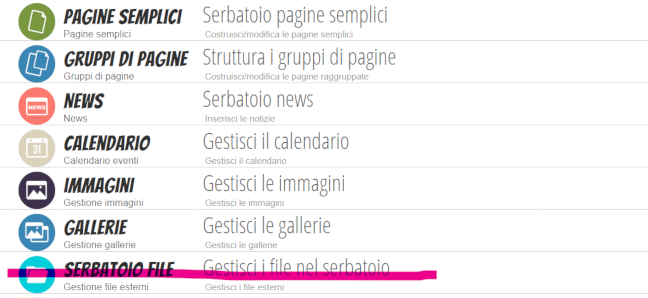

# Manuale uso sito marconiverona.edu.it

## News

Le news sono inserite a mano e si parte dal menu principale Serbatoio News

## Funzioni Strumentali e editor sito: pagine semplici, pagine di gruppo, folder condivisi 

### Accesso editing pagine

Registro online

	Applicazioni

	Applicazioni - 1VisioneWeb

	Applicazioni - 1VisioneWeb - Menu
	

### Attività

Le funzioni strumentali e gli editor del sito hanno **già** (PER ORA) a disposizione:

*	pagina semplice
*	cartella condivisa su g-suite

Alle pagine semplici a loro dedicate, le funzioni strumentali accedono con l'account *spaggiari*. 

Le pagine contengono testo ed eventualmente collegamenti altre pagine web, collegamenti a file (allegati) o riferimenti a file g-suite.

*	I riferimenti a file sono aggiunti direttamente nella pagina 
*	I collegamenti a file sono verso documenti condivisi su g-suite
 
L'accesso alla cartella condivisa su g-suite (condivisione di file e cartelle specifici per funzione) che equivale alla voce Archivio Documenti sono accessibili via portale Cloud G Suite con account *marconiverona.edu.it*

I folder condivisi sono accessibili:

*	in lettura a tutti direttamente con il link della cartella condivisa 
*	in modifica ai proprietari della cartella (esempio cartella Supporto docenti) dopo aver fatto l'accesso tramite account marconiverona.edu.it

### Organizzazione pre-esistente per editor

Per ogni funzione strumentale o editor è stato creato un gruppo di pagine contenente:

	la pagina semplice (con lo stesso nome del gruppo)
	(opz) un link con il nome **documenti** alla cartella condivisa pubblica su g-suite (il cui nome è associato al gruppo)
	
Esempio:

*Supporto ai docenti*

Pagina semplice

	Supporto ai docenti
	
Pagine del gruppo

	Supporto ai docenti (*aggancio pagina semplice*) Supporto ai docenti 
		
	Documenti (link esterno ricavato da g-suite) https://drive.google.com/drive/folders/1oWSS_aOBPmExsrUvVrUJfpasb0s8WoW1?usp=sharing

### Nuove pagine semplici

Agli editor è permesso creare nuove pagine semplici, che dovranno essere poi rese accessibili dagli amministratori

#### Link g-suite presenti
 
**PCTO**

https://drive.google.com/drive/folders/1kscevvI2OBKu-mqkj3-Nb1Y55beWelEX

**Supporto docenti**

https://drive.google.com/drive/folders/1oWSS_aOBPmExsrUvVrUJfpasb0s8WoW1?usp=sharing

##### NOTA ADMIN

In Pagine di gruppo già create gli editor non possono modificare nulla, ma possono modificare le pagine semplici appartenenti al gruppo o pagini semplici da associare a nuove Pagine di gruppo. 
L'inserimento nel sito delle nuove Pagine (di gruppo e semplici all'interno del nuovo gruppo) sarà a cura dell'amministratore.
L'attribuzione dei diritti a un editor avviene sulla Pagina di gruppo che fa ereditare alle pagine semplici la stessa autorizzazione.

